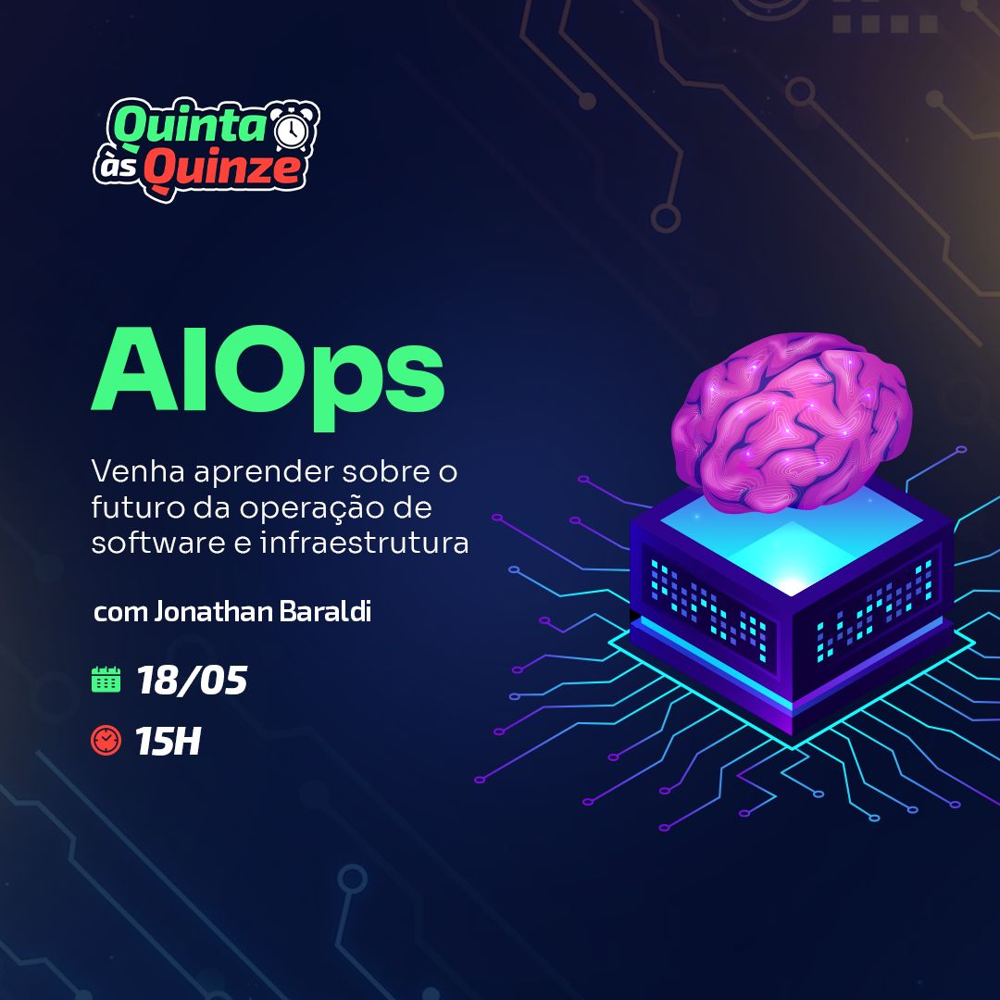

https://devopsforlife.io

https://www.linkedin.com/in/jonathanbaraldi/

https://youtube.com/jonathanbaraldi 

https://www.instagram.com/devopsforlife/

Twitter : @BaraldiJonathan





# AIOps - 18 de maio de 2023


## 1. Introdução

Definição de AIOps: AIOps significa Inteligência Artificial para Operações de TI. Refere-se à aplicação de aprendizado de máquina e ciência de dados para resolver problemas de operações de TI. As plataformas AIOps aprimoram a tomada de decisões ao contextualizar uma quantidade enorme de dados que seria impossível para os humanos processarem.

## 2. A Necessidade de AIOps

Transformação Digital Rápida: Com as empresas adotando soluções digitais em uma taxa sem precedentes, a complexidade das operações de TI aumentou. A gestão manual já não é mais viável ou eficiente.

Sobrecarga de Dados: A quantidade de dados produzidos pelas modernas infraestruturas de TI é enorme. Extrair insights significativos desses dados está além da capacidade humana.

Resolução Proativa de Problemas: A gestão tradicional de operações de TI é reativa. AIOps permite a identificação e resolução proativa de problemas, muitas vezes antes que eles impactem os usuários.

## 3. Capacidades-chave de AIOps

Detecção de Anomalias: Utilizando algoritmos de aprendizado de máquina, AIOps pode detectar anomalias no comportamento do sistema que possam indicar um problema.

Correlação de Eventos: AIOps pode correlacionar vários eventos para identificar padrões, reduzir ruído e destacar incidentes significativos.

Análise de Causa Raiz: AIOps pode analisar os dados do sistema para identificar a causa raiz dos problemas.

Análise Preditiva: AIOps pode prever possíveis problemas futuros com base em dados históricos.
Automação: AIOps pode automatizar tarefas rotineiras e respostas a eventos comuns, liberando a equipe de TI para tarefas mais complexas.

## 4. Exemplos Reais de AIOps

Exemplo 1: [Empresa X] estava enfrentando frequentes interrupções de serviço devido à complexidade de sua infraestrutura de TI. Ao implementar uma solução AIOps, eles conseguiram automatizar a detecção de problemas e reduzir seu tempo médio de resolução (MTTR) em 40%.

Exemplo 2: [Empresa Y], um gigante do comércio eletrônico, utilizou AIOps para analisar e correlacionar eventos em toda a sua infraestrutura. Isso permitiu que identificassem um problema recorrente com seu gateway de pagamento antes que pudesse causar uma interrupção significativa para os clientes.

Exemplo 3: [Empresa Z], uma grande companhia aérea, usou AIOps para prever possíveis problemas de TI que poderiam impactar as operações de voo. Essa abordagem proativa levou a uma redução significativa nas interrupções operacionais.

## 5. Futuro do AIOps

AIOps está preparado para desempenhar um papel crítico nas operações de TI à medida que as empresas continuam a se transformar digitalmente.

Integração de AIOps em várias funções de negócios, como segurança, atendimento ao cliente e gerenciamento da cadeia de suprimentos.

AIOps e computação de borda: À medida que os dispositivos IoT continuam a proliferar, AIOps pode ser usado para gerenciar esses dispositivos e processar dados na borda.


## 6. Conclusão

Recapitulação dos benefícios de AIOps e sua crescente importância nas operações de TI modernas.

Chamada à ação: Incentive o público a considerar como o AIOps poderia beneficiar suas próprias organizações.


# Referências


https://www.gartner.com/en/information-technology/glossary/aiops-artificial-intelligence-operations

https://www.ibm.com/br-pt/topics/aiops

https://www.veritas.com/pt/br/information-center/aiops-definitive-guide


# CUPONS de 50%

Plano Ninja - 50%
https://pay.hotmart.com/C76066456T?off=j3ciub4g

Plano Jedi - 50%
https://pay.hotmart.com/C76066456T?off=xqi2zdhn

Plano SuperSayajin
https://pay.hotmart.com/C76066456T?off=qmebrort


# EKS - DEMO


Levantar o cluster EKS com GuardDuty habilitado.

```sh
aws eks update-kubeconfig --region us-east-1 --name demo
```

Verificar se está enable

```sh
aws guardduty create-detector --enable --data-sources Kubernetes={AuditLogs={Enable=true}}
```

```json
{
    "DetectorId": "b6b992d6d2f48e64bc59180bfexample"
}
```

# EKS Findings

EKS Findings

1. Execution:Kubernetes/ExecInKubeSystemPod
2. Discovery:Kubernetes/SuccessfulAnonymousAccess
3. Policy:Kubernetes/AnonymousAccessGranted
4. Impact:Kubernetes/SuccessfulAnonymousAccess
5. Policy:Kubernetes/AdminAccessToDefaultServiceAccount
6. PrivilegeEscalation:Kubernetes/PrivilegedContainer
7. Persistence:Kubernetes/ContainerWithSensitiveMount


## 1 - Execução Insegura dentro do pod no namespace kube-system

Esta descoberta indica que um comando foi executado dentro de um pod no namespace kube-system no Cluster EKS.

Execute os comandos abaixo para gerar esta descoberta.

k8s-app	kube-dns

```sh
kubectl -n kube-system exec $(kubectl -n kube-system get pods -o name -l k8s-app=aws-node | head -n1) -c aws-node -- cd /
```

Dentro de alguns minutos veremos a descoberta Execution:Kubernetes/ExecInKubeSystemPod no portal GuardDuty.

## 2 - Acesso Anônimo Concedido à API do Kubernetes

Esta descoberta indica que o usuário anônimo system:anonymous foi concedido permissões de API no cluster EKS. Isso permite acesso não autenticado às APIs permitidas.

Para simular isso, vamos criar um role pod-create no namespace default.

```sh
kubectl create role pod-create --verb=get,list,watch,create,delete,patch --resource=pods -n default
```

Agora que a role foi criada, podemos vinculá-la com o usuário system:anonymous. O comando abaixo criará uma rolebinding chamada pod-access vinculando a role pod-create ao usuário chamado system:anonymous.

```sh
kubectl create rolebinding pod-access --role=pod-create --user=system:anonymous
```

Dentro de alguns minutos veremos a descoberta Policy:Kubernetes/AnonymousAccessGranted no portal GuardDuty.


## 3 - Táticas de Descoberta para acessar a API do Kubernetes Anonimamente

Esta descoberta é usada para indicar que a API do Kubernetes, comumente usada para obter conhecimento sobre os recursos, foi invocada por um usuário anônimo system:anonymous.

Para simular isso, precisaremos criar uma clusterrolebinding para vincular a clusterrole chamada anonymous-view ao usuário chamado system:anonymous.

```sh
kubectl create clusterrolebinding anonymous-view --clusterrole=view --user=system:anonymous
```
Note que o comando acima de rolebinding irá acionar a descoberta Policy:Kubernetes/AnonymousAccessGranted no guard duty em poucos minutos.

Identifique a URL do servidor API do cluster e execute uma chamada HTTP get para o URI /api/v1/pods usando curl. Isso é equivalente a executar kubectl get pods -A -o json. A diferença entre kubectl e curl é que, ao usar kubectl, anexaremos um token de autenticação de portador para autenticar, entretanto ao executar curl não estamos usando nenhum token de autenticação de portador e pulando a autenticação e usando system:anonymous para autorização.

```sh
API_URL=$(aws eks describe-cluster --name $EKS_CLUSTER_NAME --query "cluster.endpoint" --region $AWS_DEFAULT_REGION --output text)
curl -k $API_URL/api/v1/pods
```

Dentro de alguns minutos veremos a descoberta Discovery:Kubernetes/SuccessfulAnonymousAccess no portal GuardDuty.


## 4 - Criação não autorizada ou adulteração de recursos por usuário não autenticado

Esta descoberta é usada para indicar que uma API comumente usada para adulterar recursos em um cluster Kubernetes foi invocada por um usuário não autenticado.

Para simular isso, vamos criar dois recursos de roles, pod-create e psp-use.

```sh
kubectl create role pod-create --verb=create --resource=pods -n default
kubectl create role psp-use --verb=use --resource=podsecuritypolicies -n default
```

Uma vez que a role é criada, precisaremos vinculá-la com o usuário system:anonymous. O comando abaixo criará uma rolebinding chamada pod-access e psp-access vinculando as roles pod-create e psp-use ao usuário chamado system:anonymous.


```sh
kubectl create rolebinding pod-access --role=pod-create --user=system:anonymous -n default
kubectl create rolebinding psp-access --role=psp-use --user=system:anonymous -n default
```

Note que o comando acima de rolebinding irá acionar a descoberta Policy:Kubernetes/AnonymousAccessGranted no guard duty em poucos minutos.

Agora vamos criar um Pod chamado nginx usando uma chamada HTTP post.

```sh

API_URL=$(aws eks describe-cluster --name $EKS_CLUSTER_NAME --query "cluster.endpoint" --region $AWS_DEFAULT_REGION --output text)
curl -k -v $API_URL/api/v1/namespaces/default/pods -X POST -H 'Content-Type: application/yaml' -d '---
```

Verifique se o Pod está em execução.

```sh
kubectl get pods -n default
```

Dentro de alguns minutos veremos a descoberta Impact:Kubernetes/SuccessfulAnonymousAccess no portal GuardDuty.


## 5 - Acesso Admin ao Default ServiceAccount

Neste exercício de laboratório, concederemos privilégios de admin ao Default ServiceAccount, o que pode resultar em Pods sendo lançados inadvertidamente com privilégios de admin. Isso não é uma prática recomendada porque os Pods recebem o token do Default ServiceAccount. Isso dará permissões administrativas do Kubernetes sem intenção para usuários que têm acesso exec aos Pods.

Para simular isso, precisaremos vincular a clusterrole cluster-admin a um ServiceAccount chamado default.

```sh

kubectl create rolebinding sa-default-admin --clusterrole=cluster-admin --serviceaccount=default:default --namespace=default
```

Dentro de alguns minutos veremos a descoberta **Policy:Kubernetes/AdminAccessToDefaultServiceAccount** no portal GuardDuty.

## 6 -  Container Privilegiado

Esta descoberta indica que um container privilegiado com acesso ao nível de root foi lançado no seu cluster Kubernetes.

Para simular a descoberta, aplicaremos o seguinte yaml.


```yaml
apiVersion: apps/v1
kind: Deployment
metadata:
  name: ubuntu-privileged
spec:
  selector:
    matchLabels:
      app: ubuntu-privileged
  replicas: 1
  template:
    metadata:
      labels:
        app: ubuntu-privileged
    spec:
      containers:
      - name: ubuntu-privileged
        image: ubuntu
        ports:
        - containerPort: 22
        securityContext:
          privileged: true

```

Crie o deployment executando o seguinte comando.

```sh
kubectl apply -f /workspace/modules/security/Guardduty/privileged/privileged-pod-example.yaml
```

Dentro de alguns minutos veremos a descoberta PrivilegeEscalation:Kubernetes/PrivilegedContainer no portal GuardDuty.


## 7 - Container com Montagem Sensível

Esta descoberta indica que um container foi lançado com um caminho de host externo sensível montado dentro.

Para simular a descoberta, estaremos reutilizando o manifesto de Container Privilegiado e aplicando uma correção com a montagem do volume do caminho do host. Vamos aplicar a versão corrigida do container privilegiado do exemplo anterior com o caminho /etc montado no caminho /test-pd do container.

```yaml
apiVersion: apps/v1
kind: Deployment
metadata:
  name: ubuntu-privileged
spec:
  selector:
    matchLabels:
      app: ubuntu-privileged
  replicas: 1
  template:
    metadata:
      labels:
        app: ubuntu-privileged
    spec:
      containers:
      - name: ubuntu-privileged
        image: ubuntu
        ports:
        - containerPort: 22
        securityContext:
          privileged: true
        volumeMounts:
        - mountPath: /test-pd
          name: test-volume
      volumes:
      - name: test-volume
        hostPath:
          path: /etc

```

Rode o comando para aplicar

```sh
kubectl apply -f /workspace/modules/security/Guardduty/mount/privileged-pod-example.yaml
```

Dentro de alguns minutos veremos a descoberta Persistence:Kubernetes/ContainerWithSensitiveMount no portal GuardDuty.


